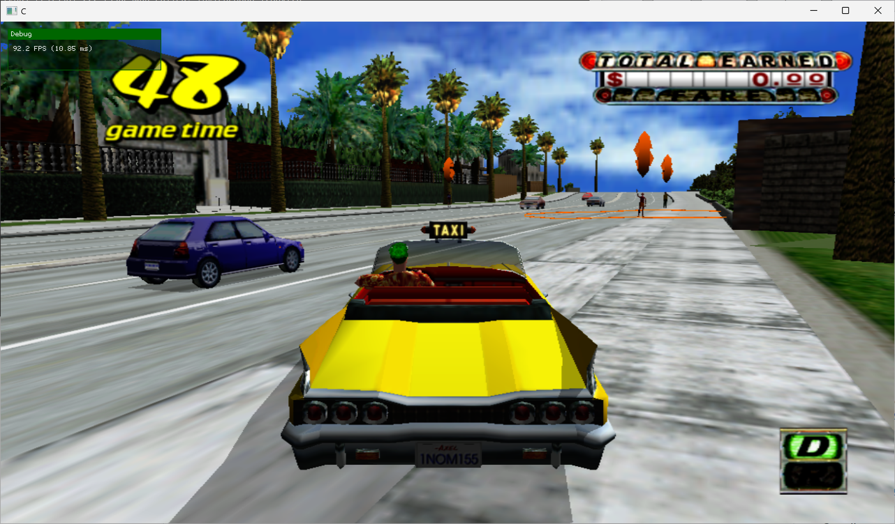
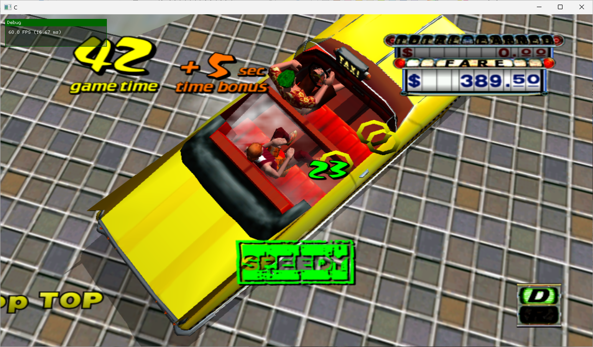

# Crazy Taxi -- Static Recompilation

**HEY HEY HEY, come on over and have some fun with CRAAAZY TAXI!**

A static recompilation of [Crazy Taxi](https://en.wikipedia.org/wiki/Crazy_Taxi) (Xbox 360 / XBLA, 2010) to native x86-64 PC using [XenonRecomp](https://github.com/hedge-dev/XenonRecomp) and the [ReXGlue SDK](https://github.com/rexglue/rexglue-sdk).

No emulation. No interpreter. The original PowerPC code is translated directly into C++ that compiles to native x64. It's like getting a fare from 2010 and drifting it straight into 2026.




## Status

| Milestone | Status |
|-----------|--------|
| STFS / XEX extraction | Done |
| PE analysis & ABI scanning | Done |
| XenonRecomp configuration | Done |
| PPC -> C++ recompilation | Done (9,008 functions) |
| Switch table detection | Done (13 tables) |
| XenonRecomp instruction patches | Done (23 new handlers) |
| ReXGlue SDK runtime | Done |
| First boot | Done |
| D3D12 GPU rendering | Done (1280x720 framebuffer) |
| Keyboard input driver | Done |
| Xbox controller (XInput) | Done |
| Timebase scaling (49.875 MHz) | Done |
| Audio (XMA/ADX) | Partial (title/demo audio works, no in-game audio) |
| Content / license unlock | Not Started |
| Settings & config menu | In Progress |

## Game Information

- **Title:** Crazy Taxi
- **Title ID:** 0x58410A34
- **Developer:** Hitmaker / SEGA
- **Publisher:** SEGA
- **Release:** 2010 (XBLA)
- **Genre:** Racing / Arcade
- **Players:** 1
- **Original Platform:** Sega Dreamcast (1999), ported to XBLA
- **Score Type:** MONEY (naturally)

## Xbox 360 Binary Details

| Property | Value |
|----------|-------|
| Image base | `0x82000000` |
| Entry point | `0x8212A5F0` |
| Code range | `0x820C0000` - `0x822C9000` |
| Code size | 2.0 MB |
| Image size | 11.7 MB |
| PE sections | 9 |
| Compression | LZX |
| Encryption | AES-128 |

## Repository Structure

```
ctxbla/
├── config/                     # XenonRecomp configuration
│   ├── crazytaxi.toml          # Main recomp config (ABI addresses)
│   ├── crazytaxi_rexglue.toml  # ReXGlue SDK code generation config
│   └── crazytaxi_switch_tables.toml  # Jump table definitions
├── docs/
│   ├── binary-analysis.md      # PE section layout and analysis
│   └── xenonrecomp-workflow.md  # Step-by-step recompilation guide
├── generated/                  # XenonRecomp-generated glue code
│   ├── crazytaxi_config.h      # Address constants
│   ├── crazytaxi_init.cpp/h    # Function table linkage
│   └── sources.cmake           # Generated source list
├── ppc/                        # Recompiled PPC -> C++ (gitignored, large)
│   └── ppc_config.h            # PPC image constants
├── project/                    # ReXGlue SDK project (active build)
│   ├── CMakeLists.txt          # C++23, Clang, links rex:: libraries
│   ├── CMakePresets.json       # Build presets
│   └── src/
│       ├── main.cpp            # CrazyTaxiApp (ReXApp), VEH, crash logging
│       ├── stubs.cpp           # Game-specific Xbox 360 API stubs
│       ├── keyboard_driver.cpp/h # Keyboard-to-gamepad input mapping
│       ├── settings.cpp/h      # TOML-based settings persistence
│       └── menu.cpp/h          # Win32 menu bar + ImGui dialogs
├── scripts/
│   └── extract_switch_tables.py
├── tools/
│   ├── extract_stfs.py         # STFS/LIVE container extractor
│   ├── extract_pe.py           # XEX2 -> PE image extractor (LZX)
│   ├── find_abi_addrs.py       # ABI register save/restore scanner
│   ├── find_missing_vtable_funcs.py  # Vtable boundary detector
│   ├── dump_pe.cpp             # PE header dumper
│   └── patches/                # XenonRecomp instruction patches
│       ├── xenonrecomp-altivec-vmx.patch
│       └── xenonrecomp-missing-instructions.patch
└── extracted/                  # (gitignored) Game files from STFS
    ├── default.xex             # Original Xbox 360 executable
    ├── default_pe.exe          # Decompressed PE image
    ├── *.afs                   # CRI AFS audio/data archives
    ├── SoundData/              # ADX music tracks
    └── NewTexture/             # Localized textures and UI
```

## Prerequisites

- **CMake** 3.25+
- **Clang** 18+ (LLVM)
- **Ninja** build system
- **Python** 3.8+ (for extraction tools)
- **ReXGlue SDK** v0.1.0 ([rexglue-sdk](https://github.com/rexglue/rexglue-sdk))
- **XenonRecomp** (with custom instruction patches -- see tools/patches/)

## Quick Start

**1. Extract game files from the STFS container:**
```bash
py tools/extract_stfs.py path/to/58410A34/000D0000/<hash> extracted/
```

**2. Extract the PE image from the XEX:**
```bash
py tools/extract_pe.py extracted/default.xex extracted/default_pe.exe
```

**3. Run XenonRecomp to translate PPC -> C++:**
```bash
XenonRecomp config/crazytaxi.toml
```

**4. Generate ReXGlue SDK bindings:**
```bash
rexglue codegen config/crazytaxi_rexglue.toml
```

**5. Build and run:**
```bash
cd project
cmake -S . -B build -G Ninja -DCMAKE_BUILD_TYPE=Release \
  -DCMAKE_C_COMPILER="C:/Program Files/LLVM/bin/clang.exe" \
  -DCMAKE_CXX_COMPILER="C:/Program Files/LLVM/bin/clang++.exe" \
  -DCMAKE_LINKER="C:/Program Files/LLVM/bin/lld-link.exe" \
  -DCMAKE_RC_COMPILER="C:/Program Files/LLVM/bin/llvm-rc.exe"
ninja -C build
./build/crazytaxi path/to/extracted/
```

## How It Works

Static recompilation is fundamentally different from emulation. Instead of interpreting PowerPC instructions at runtime (like Xenia), we translate the entire Xbox 360 binary ahead of time into equivalent C++ code that compiles to native x64.

The result: the game runs at native speed with zero interpretation overhead. Every PowerPC function becomes a C++ function. Every branch becomes a branch. The CPU does what it was born to do -- execute native code, not pretend to be a different CPU.

The [ReXGlue SDK](https://github.com/rexglue/rexglue-sdk) provides the runtime environment: GPU command translation (Xenos -> D3D12), audio decoding, input handling, threading, and ~250 Xbox 360 kernel API implementations. The game's recompiled code calls into these just like it called Xbox 360 APIs on the original hardware.

### Timing Fix

Xbox 360 games expect a 49.875 MHz timebase clock and 60 Hz VSync. Modern PCs have TSC clocks running at 3-4 GHz. Without correction, the game would run at warp speed.

Two fixes are applied (ported from [simpsonsarcade](https://github.com/sp00nznet/simpsonsarcade)):

1. **Timebase scaling** -- Overrides `__rdtsc()` (generated for PPC `mftb` instructions) to return scaled values matching the Xbox 360's 49.875 MHz clock via `rex::chrono::Clock::QueryGuestTickCount()`
2. **Physical address offset** -- Maps physical addresses >= 0xE0000000 at +0x1000 offset for VEH-based MMIO interception (GPU/XMA register access)

## Known Issues

- **Crashes during gameplay** -- The game can crash during fare drop-offs and at high speed (e.g. driving downhill fast). Likely related to unhandled XMA audio triggers during gameplay events.
- **Title screen timing** -- You must wait until the "Hey Hey, Crazy Taxi!" voice line plays before pressing Start. Pressing Start too early will leave you stuck at the menu.
- **Alt-tab breaks arcade mode** -- If you alt-tab away after selecting Arcade Rules, the game will hang on a black screen.
- **No in-game audio** -- XMA register 0x0601 is unhandled (SDK limitation). Title screen and demo audio works.

## References

- [XenonRecomp](https://github.com/hedge-dev/XenonRecomp) -- PowerPC -> C++ static recompiler for Xbox 360
- [ReXGlue SDK](https://github.com/rexglue/rexglue-sdk) -- Xbox 360 runtime environment for recompiled games
- [UnleashedRecomp](https://github.com/hedge-dev/UnleashedRecomp) -- Sonic Unleashed static recomp (inspiration)
- [simpsonsarcade](https://github.com/sp00nznet/simpsonsarcade) -- The Simpsons Arcade recomp (sister project)
- [vig8](https://github.com/sp00nznet/vig8) -- Vigilante 8 Arcade recomp (sister project)
- [Xenia](https://github.com/xenia-project/xenia) -- Xbox 360 emulator (reference for kernel behavior)

## License

This repository contains no copyrighted game assets. You must provide your own legally obtained copy of Crazy Taxi (XBLA). The tools and runtime code are provided for educational and preservation purposes.

*Now shut up and drive.*
